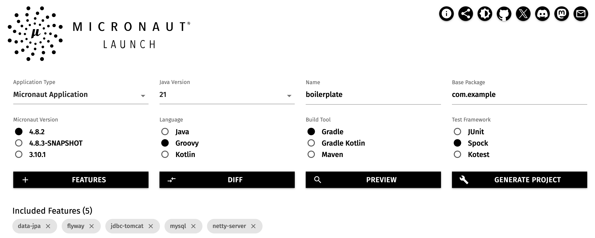
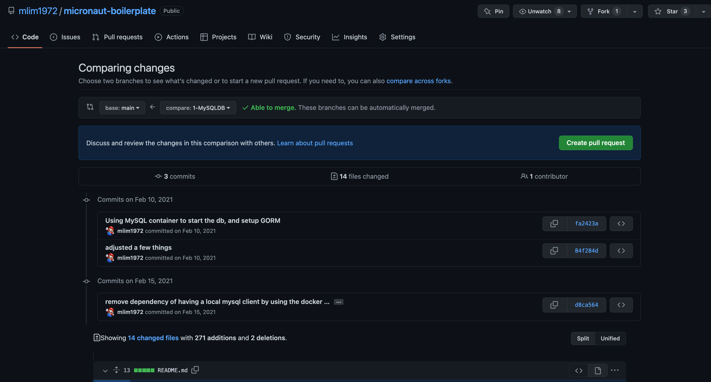

## Micronaut Boilerplate

This repo is a boilerplate for [Micronaut](https://micronaut.io/). The project was created using 
the [launch button](https://micronaut.io/launch/) in their website. The initial project uses
the following configuration:
- Type: Micronaut Application
  - Micronaut Version: 4.8.2
- Java Version: 21
  - Language: Groovy
- Name: boilerplate
- Build Tool: Gradle
- Base Package: com.example
- Test Framework: Spock

and the following Features:
- data-jpa
- mysql
- flyway
- jdbc-tomcat
- netty-server

<p align="center">

<b><sub>Fig.1 - Launch Configuration</sub></b>
</p>

This boilerplate will be a guide to many features microservices use like database
connectivity, containers, authentication, OpenAPI, tracing, etc... 
Those features will be added as branches that build on top of the 
previous one.
Comparing branches can be done by initiating the creation of a Pull Request and 
comparing the branches.

<p align="center">

<b><sub>Fig.2 - Pull Request branch comparison</sub></b>
</p>

## Branches
### main
The main branch is the initial project configured as mentioned above and following the 
[CREATING YOUR FIRST MICRONAUT APPLICATION](https://guides.micronaut.io/latest/creating-your-first-micronaut-app-gradle-groovy.html)
guide with a few changes:
- Used Launch Button from the website rather than using the CLI
- [HelloController](src/main/groovy/com/example/controller/HelloController.groovy) is in a folder called controllers, so we can add all our controllers here
- Added a service class [HelloService](src/main/groovy/com/example/service/HelloService.groovy) under the services folder to store all our services
- Created [controllers](src/test/groovy/com/example/controller) and 
  [services](src/test/groovy/com/example/service) test files 
  for their corresponding classes

### 1.ORM
This branch adds a good amount of changes. The main addition is the usage of ORM to manage
database actions.
Here is the list of changes:
- [build.gradle](build.gradle). New entries are added to the build file:
  - Micronaut Data Processor. This will work in conjunction to the Micronaut Data and JPA
  - Spring Security Crypto. This library brings the Spring Security Crypto library for password encoding
  - slf4j compatibility layer for logging
  - H2 DB for runtime testing only
- [controller/UserController](src/main/groovy/com/example/controller/UserController.groovy).
  A new controller for managing the user endpoints.
  - **@ExecuteOn** annotations that specifies which executor the task should run on 
  - **@Controller** annotation marks this class as a controller
  - **@Slf4j** annotation to get a hold of the logger
  - **@Nullable** annotation specifying that the field could be null
  - **@QueryValue** annotation tells the method that this argument comes from the query param
- [domain/User](src/main/groovy/com/example/domain/User.groovy). This is the domain
  object for User. The domain object will be use as the user table represented
  as an object. This class uses the following annotations:
  - **@Table** annotation to change the name of the database table
  - **@Entity** annotation to make it known by the system that this class is a domain object
  - **@ID** annotation to mark a field as the primary key
  - **@GeneratedValue** annotation expresses how the autogeneration of the ID should be done
  - **@Version** annotation to mark a field as the optimistic locking field
  - **@NotNull** annotation to mark the fields with not null constraint
  - **@NotEmpty** annotation to mark the field as not blank. Use by the validation engine
  - **@Column** annotation to specify different property for the column like name, type, etc...
  - **@Email** annotation to mark a field as email. The regex is to create a regular expression for the validation engine
  - **@DateCreated** annotation is populated by the engine when a new record is inserted
  - **@DateUpdated** annotation is populated by the engine when a record is updated
- [repository/UserRepository](src/main/groovy/com/example/repository/UserRepository.groovy). 
  This is the user repository. It will handle a lot of CRUD operations to the Users
- service folder. All services under this folder should use the **@Singleton** annotation
  to mark the class as a Service. All services are instantiated upon application start
- [service/security/BCryptPasswordEncoderService](src/main/groovy/com/example/service/security/BCryptPasswordEncoderService.groovy).
  Service class to handle password encoding
- [service/UserService](src/main/groovy/com/example/service/UserService.groovy).
  User service for all database action. This class is where all business logic for
  user should be done. This service uses the following annotations:
  - **@Singleton** annotation marks this class as a singleton class. This means that 
    this object will be instantiated during the application and hence it is considered
    a service that can be injected into other classes.
  - **@Transactional** annotation at the class level makes each method in the class
    as execution within a transaction
- [application.yml](src/main/resources/application.yml). The main configuration file
  for the application. This configuration uses MySQL via a test container. This means
  that there is no need to install a database in the local environment. The test container
  will instantiate a MySQL database and the application will connect to it. 
- [application-test.yml](src/test/resources/application-test.yml). This configuration
  file is used for testing. It uses H2 database for testing. This is a in-memory database
  that is used for testing. The database is created and destroyed for each test

### 2.MySQL
This branch adds a good amount of changes. Mainly, the changes are around using MySQL that 
starts as a container and setup the schema ownership to a specific user. Also, there are
changes for security and JWT. Here is the list of changes:
- [build.gradle](build.gradle). New entries are added to the build file:
  - Security annotation and JWT
  - Reactor for UI
- [run-mysql.sh](run-mysql.sh). This script will start a MySQL container and create a user 
  and database for the application. The script will also create the schema and grant ownership 
  to the user
- [setenv.sh](setenv.sh). This script will set the environment variables for the application
  to use like the database URL, username, and password.
- [setup-schema.sh](setup-schema.sql). This script will setup the database schema and grant
  ownership to the user
- [controller/HelloController](src/main/groovy/com/example/controller/HelloController.groovy). 
  Updated the class to be protected by the security annotation **'@Secured("isAuthenticated()")'** 
  and the GET endpoint is now requesting for the principal to be passed in
- [controller/UserController](src/main/groovy/com/example/controller/UserController.groovy). 
  Updated the class to bypass security using the annotation **'@Secured("isAnonymous()")'**.
  This annotation will let non-authenticated users to access the endpoints
- [domain/Role](src/main/groovy/com/example/domain/Role.groovy). This is a new domain object that will
  contain all the roles int the system. The comment at the end of the class identifies Users that 
  have the role. Currently, that code is commented out since there is no need to have a two-way 
  relationship. Only Users have the link to Roles using a many-to-many relationship reference table.
  This class uses the following annotations: @Entity, @ToString, @Id, @GeneratedValue, @Version, 
  @NotNull, @NotEmpty.
- [domain/User](src/main/groovy/com/example/domain/User.groovy). The User domain is updated to have a 
  Many-to-many relationship with Role since a user can have multiple roles and a role can be assigned
  to multiple users. The new annotation is: **'@ManyToMany(mappedBy = "user", fetch = FetchType.EAGER)'**. 
  This annotation indicates the relationship to Role. The fetch type is set to eager since we want the roles 
  to be loaded when the user is loaded. In addition, we use the **@JoinTable** annotation to specify the
  reference table. The reference table is the intermediate table to make User and Role a
  many-to-many relationship. The **@JoinTable** annotation has the following attributes:
  - **name**. This is the name of the reference table
  - **joinColumns**. This is the column that is used to join the User table to the reference table
  - **inverseJoinColumns**. This is the column that is used to join the Role table to the reference table
  - **uniqueConstraints**. This is used to specify the unique constraint for the reference table
  - **schema**. This is used to specify the schema for the reference table
- [repository/RoleRepository](src/main/groovy/com/example/repository/RoleRepository.groovy). This is the 
  repository for Role. This class uses the following annotations: @Repository, @Transactional
- [repository/UserRepository](src/main/groovy/com/example/repository/UserRepository.groovy). 
  Updated the UserRepository to add a new method: findOneByUsername. This method will find a
  user by the username
- [service/security/AuthProviderService](src/main/groovy/com/example/service/security/AuthProviderService.groovy)
  This is the authentication provider service. This service provides authentication based on the 
  credentials from the DB. Since this class implements the 
  interface **AuthenticationProvider**, Micronaut will automatically use this class for 
  authentication
- [service/RoleService](src/main/groovy/com/example/service/RoleService.groovy). 
  This is the service for Role relation DB activities. For the most part, this class
  insert roles to the database.
  This class uses the following annotations: @Singleton, @Transactional
- [service/UserService](src/main/groovy/com/example/service/UserService.groovy). 
  Added a couple of methods and updated the existing methods
- [resources/application.yml](src/main/resources/application.yml). Updated the configuration file
  to use MySQL directly rather than testcontainers. 
  The configuration file also has the security configuration. The security
  configuration is used to configure the authentication provider and the JWT configuration.
  Notice the $ sign as the value for some of the properties. This is used to get the value from
  the environment variables. The environment variables are set in the script [setenv.sh](setenv.sh).
  Example: **'${JWT_SECRET}'**. This will get the value from the environment variable JWT_SECRET

Before running the application, you need to source the setenv.sh and then start MySQL 
using the script [run-mysql.sh](run-mysql.sh). This script will start a MySQL container 
and create the database and user for the application. Since the script starts the
database as a container, **Docker should be installed** in the local environment using
[Docker Desktop](https://www.docker.com/products/docker-desktop).

```bash
source setenv.sh
./run-mysql.sh
```

After running the command above, the DB will be running and setup with a schema
and a username and password from the [setenv.sh](setenv.sh) script. If you connect
to the DB, you will notice that there is no tables in the schema. This is because
the application will create the tables when it starts. What makes this
possible is the section on JPA in the [application.yml](src/main/resources/application.yml)
file. The property **'jpa.default.properties.hibernate.hbm2ddl.auto'** is set to **'update'**.

```yaml
jpa:
  default:
    properties:
      hibernate:
        hbm2ddl:
          auto: update
```

At this point you can start the application via gradle.

Note: To run all test is still possible without starting MySQL since the tests are using H2
database and 

### 2.Flyway
[Flyway](https://flywaydb.org/) is a database migration tool. It is used to manage the database schema and data.
The application will use Flyway to create the database schema and insert seed data.
Using Flyway will make the application more portable since the database schema and data
will be created when the application starts. This will make it easier to deploy the
application to different environments. In addition, as we add new features to the application
and the database schema changes, Flyway will be used to update the database schema. 
Flyway creates a table in the database to keep track of the changes. The table is called
**'flyway_schema_history'**. This table is used to keep track of the changes that have been
applied to the database. The table has the following columns:
- installed_rank. This column is used to keep track of the order of the changes
- version. This column is used to keep track of the version of the change
- description. This column is used to keep track of the description of the change
- type. This column is used to keep track of the type of the change
- script. This column is used to keep track of the script that was used to make the change
- checksum. This column is used to keep track of the checksum of the change
- installed_by. This column is used to keep track of the user that installed the change
- installed_on. This column is used to keep track of the date and time that the change was installed
- execution_time. This column is used to keep track of the execution time of the change
- success. This column is used to keep track of the success of the change

The following files are changed to this branch:
- [build.gradle](build.gradle). Removed dependencies to Test Containers. Dependencies to
     Flyway and MySQL were already added from previous branches
- [README.md](README.md). This file was updated to add information about Flyway
- [run-mysql](run-mysql.sh). Updated the pull of MySQL version to v8 since 5.7 is no longer
     supported by Flyway
- [setenv.sh](setenv.sh). Updated the MYSQL URL to include a new parameter needed to connect
     to the MYSQL v8.0. The parameter is **'allowPublicKeyRetrieval=true'**
- [/domain/Role](src/main/groovy/com/example/domain/Role.groovy). This class was updated to
     add the following annotation **@EqualsAndHashCode**. This annotation is used to generate
     the equals and hashcode methods
- [/domain/User](src/main/groovy/com/example/domain/User.groovy). This class was updated to
     add the following annotation **@EqualsAndHashCode**. This annotation is used to generate
     the equals and hashcode methods
- [/domain/UserRole](src/main/groovy/com/example/domain/UserRole.groovy). This class was updated to
     add the following annotation **@EqualsAndHashCode**. This annotation is used to generate
     the equals and hashcode methods
- [/domain/UserRoleKey](src/main/groovy/com/example/domain/UserRoleKey.groovy). This class was updated to
     add the following annotation **@EqualsAndHashCode**. This annotation is used to generate
     the equals and hashcode methods
- [/repository/UserRepository](/src/main/groovy/com/example/repository/UserRepository.groovy). This class was updated to
     change the base class from **CrudRepository** to **PageableRepository** in order to support
     **list** as a pageable method
- [/controller/UserController](/src/main/groovy/com/example/controller/UserController.groovy). The get
  user pagination was updated to use the new **list** method in the **UserService**. The method was uupdated
  to receive the page and the page size as parameters
- [/service/UserService](/src/main/groovy/com/example/service/UserService.groovy). This class was updated
     to change the **list** method to use Pageable and Sort to get a list of users by page and sort
- [application.yml](/src/main/resources/application.yml). Added a parameter to the db connectivity due to 
     upgrading the DB to MySQL v8.0. In addition, since we are using Flyway to manage the database schema
     we will create DDL schema manually and hence the **jpa.default.property.hibernate.hbm2ddl.auto** 
     is set from **update** to **none**.
```yaml
jpa:
  default:
    properties:
      hibernate:
        format_sql: false
        show_sql: false
        hbm2ddl:
          auto: none
```
- [/resources/dbmigrations/V1__setting_userandrole.sql](src/main/resources/dbmigrations/V1__setting_userandrole.sql). 
  This file contains the SQL to create the initial database schema. Once this is deployed, this file will not be
  modified. New changes to the database schema will be added to new files. The files will be named in the format
    **V{version}__{description}.sql**. The version is a number that is used to keep track of the order of the changes.
  This file in particular sets up the database schema and inserts seed data. So, it creates the following tables:
    - role
    - user
    - user_role
  
  This file also seeds the table with initial data to the role table. The initial data is the following:
    - ADMIN
    - USER
    - EDITOR
- [/dbmigrationscript/v1/V1_1__seed_user](src/main/resources/db/migration/v1/V1_1__seed_user.sql).
  This is the script to insert seed data for the user table and the user role table. Flyway
  will run the .sql file above and this file in order to create the database schema and insert
  seed data. The reason we need to create a groovy script rather than adding it to the Flyway .sql file
  is that we need to use some coding not available in the .sql file. The groovy script
  adds a user to the user table using the encrypted password. Encryption is not available in SQL.
- [/controller/LoginControllerSpec](/src/test/groovy/com/example/controller/LoginControllerSpec.groovy). 
  This class was updated to change the index when inserting to tables. This is done so that while testing
  there is no conflict with previous data that was inserted to the tables
- [/controller/UserControllerSpec](/src/test/groovy/com/example/controller/UserControllerSpec.groovy).
  This class was updated to change the index when inserting to tables. This is done so that while testing
  there is no conflict with previous data that was inserted to the tables. In addition, the test was updated 
  to test the list of users by page and size
- [/service/RoleServiceSpec](/src/test/groovy/com/example/service/RoleServiceSpec.groovy). 
  This class was updated to change the authority name because the 'admin' authority was already inserted
  by flyway during the initial setup of the database schema
- [/service/UserServiceSpec](/src/test/groovy/com/example/service/UserServiceSpec.groovy). 
  This class was updated to change the index when inserting to tables. This is done so that while testing
  there is no conflict with previous data that was inserted to the tables
- [application-test.yml](/src/test/resources/application-test.yml). This file was blanked out to prevent
  the test containers from starting MySQL. Since we are using Flyway to manage the database schema, we will
  create the database schema manually and hence we do not need to start MySQL in the test containers.
  We want to use the same application.yml as when we run the application

Since we are creating a new flow for db creation, the [run-mysql.sh](run-mysql.sh) script should be run
to create the new DB schema via Flyway.